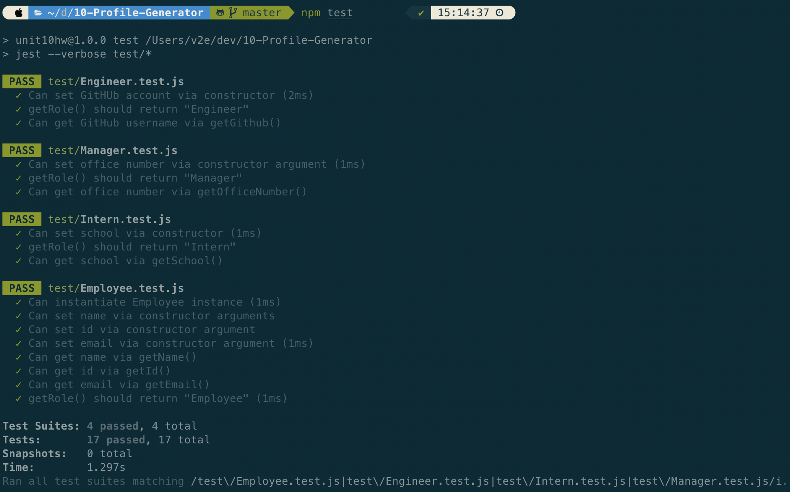
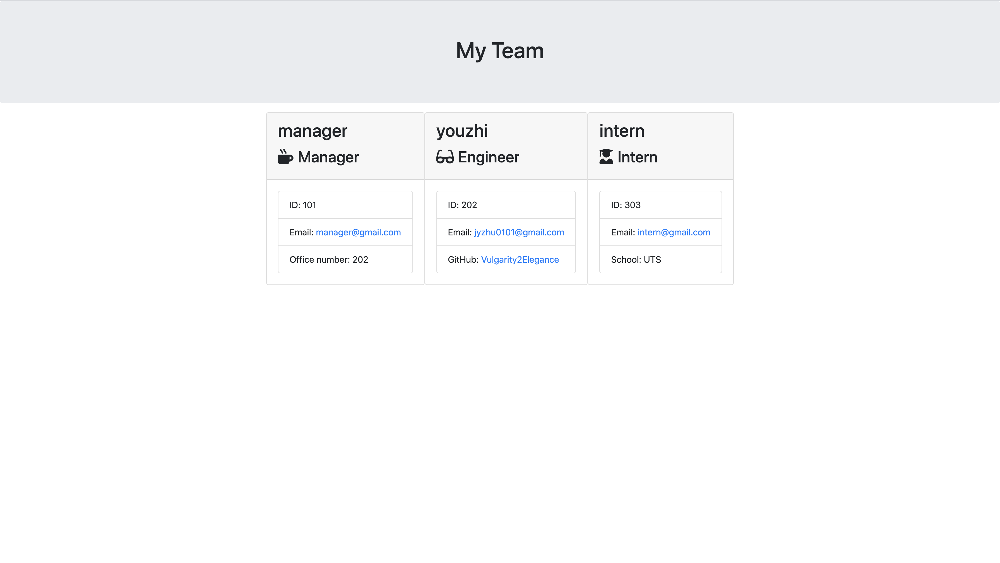

# 10-Template-Summary


## Description

A Node CLI that takes in information about employees and generates an HTML webpage that displays summaries for each person.

```
As a manager
I want to generate a webpage that displays my team's basic info
so that I have quick access to emails and GitHub profiles
```

## Table of Contents

-   [Installation](#Installation)
-   [Usage](#Usage)
-   [License](#License)
-   [Contributing](#Contributing)
-   [Tests](#Tests)
-   [Questions](#Questions)

## Installation

To install necessary dependencies, run the following command:

```
npm i
```

## Usage

The application will prompt the user for information about the team manager and then information about the team members. The user can input any number of team members, and they may be a mix of engineers and interns. This assignment must also pass all unit tests. When the user has completed building the team, the application will create an HTML file that displays a nicely formatted team roster based on the information provided by the user.


Please visit the link (https://youtu.be/c8zzcAk5tBw) to see the functionality of this app.

## License

This project is licensed under the MIT.

## Contributing

See [Questions](#Questions) section.

## Tests

To run tests, run the following command:

```
npm run test
```



## Questions

If you have any questions about the repo, open an issue or contact me directly at jyzhu0101@gmail.com.

You can find more of my work at [Vulgarity2Elegance](https://github.com/Vulgarity2Elegance).

## Screenshots


